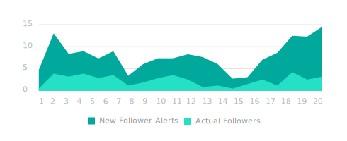

## Usage

### Best Practices

#### Sprout Primary
Primary brand colors are used for elements that reflect Sprout's brand.

- Green 500 is our primary color reserved for primary actions. Green
 500 should call attention to only the most important elements of
 design.
- Tints 100-300 &amp; 900 should be avoided in marketing illustration and design.

#### Sprout Secondary
Secondary colors are used sparingly as accents.

- Link to context specific guidelines for more specific use cases (e.g. illustration).
- A broad secondary palette is necessary for group colors and data viz.
- Red 700 is used for destructive actions and errors.

#### Bambu
Primary brand colors are used for elements that reflect Bambu's brand. 

- BambuTeal 400 is our primary color reserved for primary actions. Teal 400 should call attention to only the most important elements of design. 
- Yellow 500 is reserved for CTA buttons on the marketing page.
- When unsure of usage defer to Sprout's guidelines

#### Neutrals
The palette of the neutral shades should be used for illustration, product and marketing elements.

### Do’s and Don’ts

- **DON’T:** Use any tints or shades or add any more neutrals to this palette.
- **DO:** Use analogous color schemes for grouping.
    
- **DO:** Use complementary color schemes for comparisons.
    
- **DO:** Use opacity as a tool to draw attention to an element in the foreground.
    